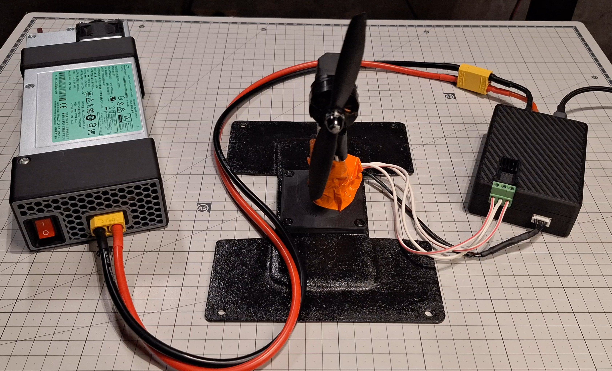
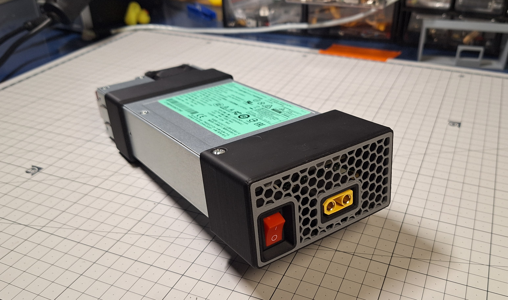
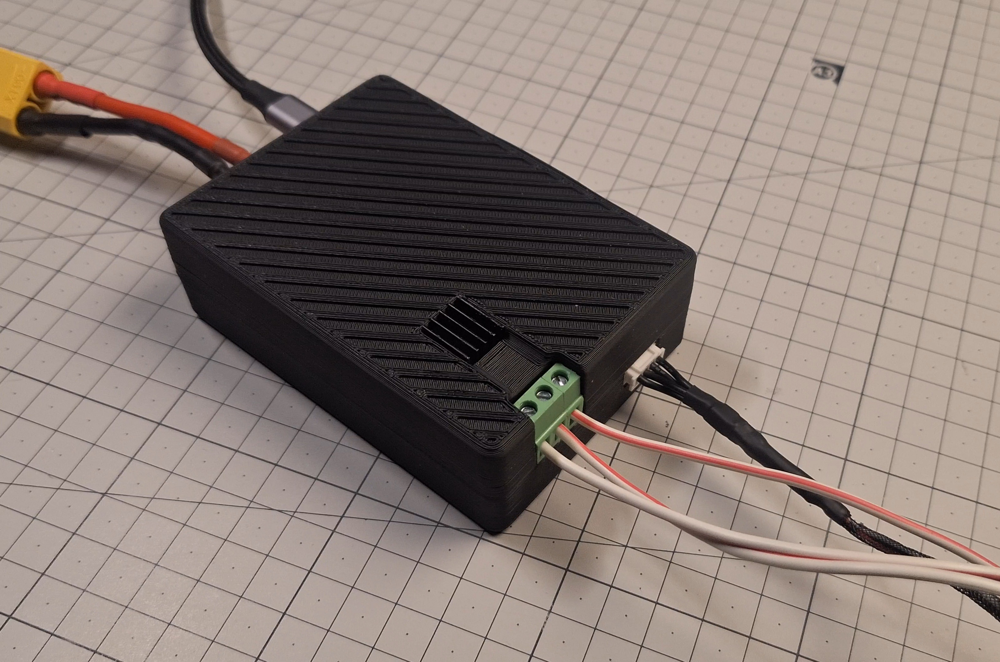
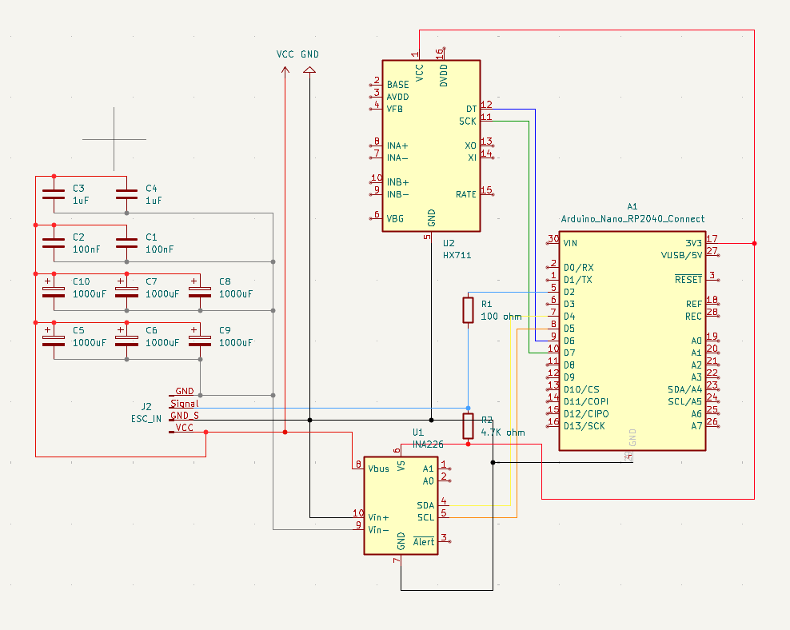

# RotorRig — DIY BLDC Motor & Prop Test Bench


RotorRig is a compact DIY platform for **repeatable testing of BLDC motors and propellers**.  
It streams data over USB as **CSV**, so you can compare setups (motor/prop/ESC/voltage) with real numbers instead of “feels faster”.

**What it does:**
- **Thrust**: load cell + HX711  
- **Electrical**: voltage / current / power via INA226 + shunt  
- **RPM**: BDShot telemetry (when ESC/firmware supports it)  
- **Logging**: CSV over Serial (examples in `logs/examples/`)

Full build journey + context: https://blueprint.hackclub.com/projects/7240

---

## Why I made it
I built RotorRig to get **repeatable, apples-to-apples comparisons** between motors and props (and later: to validate experiments like custom windings/stators).  
With the same test profile and measurement chain, it’s much easier to judge performance, efficiency, and tuning changes objectively.

---

## Safety
This spins real props — treat it like a power tool.
- Keep a clear area around the rig
- Wear eye protection
- Secure the rig to a heavy base
- First tests: low throttle / no prop

---

## Repository structure
- `cad/`
  - `export_step/` → full assembly `.STEP`
  - `source/` → Fusion 360 source `.f3z`
  - `stl/` → printable STLs
  - `renders/` → renders used below
- `docs/`
  - `images/` → build photos
  - `wiring/` → wiring diagram
- `kicad/` → schematic / connections in KiCad
- `firmware/` → PlatformIO project (RP2040)
- `logs/examples/` → example CSV logs
- `BOM.csv` → full BOM

---

## Pictures

### CAD renders
<p align="center">
  
  
  
</p>

### Build photos
<p align="center">
  
  
</p>
<p align="center">
  
  
</p>

### Wiring diagram


---

## How to build (from scratch)

### 1) 3D print the parts
All STLs are in `cad/stl/`:
- `cad/stl/Bench/` (load cell holders)
- `cad/stl/Mainboard/` (electronics enclosure)
- `cad/stl/Power supply/` (PSU stand/cover)

**Print settings used (my build):**

**ABS / ABS+ (enclosures + structural parts)**
- Layer height: **0.2 mm**
- Walls: **4**
- Infill: **40%**

**TPU (rubber feet)**
- Layer height: **0.2 mm**
- Walls: **2**
- Infill: **100%**

Hardware (inserts/screws/magnets): see **BOM**.

### 2) Mechanical assembly
- Mount the load cell using the printed holders (bench parts are in `cad/stl/Bench/`)
- Mount the motor securely and keep the thrust direction aligned with the load cell
- Make sure nothing can touch the prop (wires, zip-ties, enclosure edges, etc.)

### 3) Electronics & wiring
This version uses **perfboard + off-the-shelf modules** (no custom manufactured PCB required).
- Wiring diagram: `docs/wiring/Wiring.png`
- If you add a KiCad schematic: put it in `kicad/` (recommended: `kicad/rotorrig-mainboard/`)

### 4) Firmware (PlatformIO)
Target MCU: **WisdPi Tiny RP2040** (RP2040).  
The PlatformIO environment is set up as `board = pico`, which works for Pico-class RP2040 boards.

From the `firmware/` directory:

```bash
pio run -t upload
```

Serial monitor (115200):

```bash
pio device monitor
```

---

## How to use (typical workflow)

### 1) Connect everything
- motor ↔ ESC ↔ PSU/battery  
- RP2040 ↔ USB to PC  

Open Serial @ **115200**.

### 2) (Optional) set metadata (saved into every CSV row)
```text
setmeta <test_id> <motor_id> <kv> <prop> <battery_s> <esc_fw> <pole_pairs>
```

Example:
```text
setmeta T_CORE M_3115 900 APC8x4E 4 LANRC45A 7
```

### 3) Calibration / tare
- **Calibration** (`cal ...` + `save`) is usually done **once** (or after hardware changes).
- **Tare** should be done **before each test**.

Tare:
```text
tare
```

If you need to calibrate:
```text
cal <mass_g>
save
```

### 4) Run a test (core profile)
```text
start
autotest core
```

Stop anytime:
```text
stop
```

Emergency stop:
```text
estop
```

Command list:
```text
help
```

---

## CSV logs
RotorRig prints CSV rows over Serial. Example logs are in `logs/examples/`.

The CSV header includes (among others):
- `throttle_pct`, `RPM`, `V_bus_V`, `I_A`, `P_in_W`, `thrust_g`, `eff_g_per_W`, and metadata from `setmeta`.

---

## BOM (Bill of Materials)
Full BOM is in `BOM.csv` (repo root). Below is the same BOM as a table:

| Line | Category | Qty | Unit | Part | Manufacturer | MPN | Link |
|---:|---|---:|---|---|---|---|---|
| 1 | MCU / Control | 1 | pcs | Tiny RP2040 dev board (RP2040) | WisdPi | Tiny RP2040 (WP-2040T) | https://www.wisdpi.com/products/wisdpi-tiny-rp2040-a-tiny-cool-rp2040-dev-board-with-4mb-flash |
| 2 | Drive | 1 | pcs | ESC 45A 2–6S (BLHeli_S / DShot) | LANRC | LANRC 45A BLHeli_S 2-6S ESC | https://pl.banggood.com/LANRC-35A-or-45A-BLHeli_S-2-6S-ESC-with-RGB-LEDs-Supports-DShot150-300-600-for-FPV-Racing-Drone-p-2045658.html |
| 3 | Sensing | 1 | pcs | HX711 load cell amplifier module (24-bit ADC) | Generic / Kamami | HX711 module | https://kamami.pl/czujniki-nacisku/561387-wzmacniacz-konwerter-sygnalu-tensometru-z-ukladem-hx711-5906623473342.html |
| 4 | Sensing | 1 | pcs | INA226 current/voltage/power monitor module (I2C) | Generic / Kamami | INA226 module | https://kamami.pl/en/current-sensors/573164-module-with-ina226-current-sensor-5906623456505.html |
| 5 | Sensing | 1 | pcs | Load cell 10kg straight bar (TAL220 type) | SparkFun | SEN-13329 (TAL220 10kg) | https://www.sparkfun.com/load-cell-10kg-straight-bar-tal220.html |
| 6 | Power (DC-link) | 6 | pcs | Electrolytic capacitor low-ESR 1000µF 25V (DC-link bank) | Panasonic | EEUFR1E102B | https://www.tme.eu/en/details/eeufr1e102b/tht-electrolytic-capacitors/panasonic/ |
| 7 | Power (HF decoupling) | 2 | pcs | MLCC capacitor 1µF 50V X7R 1206 (near ESC) | Yageo | CC1206KKX7R9BB105 | https://www.tme.eu/pl/details/cc1206kkx7r9105/kondensatory-mlcc-smd/yageo/cc1206kkx7r9bb105/ |
| 8 | Power (snubber) | 2 | pcs | Film capacitor 100nF 63V (snubber/HF) | KEMET | R82DC3100AA50K | https://www.tme.eu/pl/details/r82dc3100aa50k/kondensatory-foliowe-tht/kemet/ |
| 9 | Passives | 1 | pcs | Resistor 100Ω 0.25W 1% THT | ROYALOHM | MF0S4FF1000A50 | https://www.tme.eu/en/details/mf0s4ff1000a50/tht-resistors/royalohm/ |
| 10 | Passives | 1 | pcs | Resistor 4.7kΩ 0.25W 1% THT | ROYALOHM | MF0S4FF4701A50 | https://www.tme.eu/en/details/mf0s4ff4701a50/tht-resistors/royalohm/ |
| 11 | PSU mod | 1 | pcs | Resistor 13.3kΩ 0.25W 1% THT (voltage adjust mod) | ROYALOHM | MF0S4FF1332A50 | https://www.tme.eu/lv/details/mf0s4ff1332a50/rezistori-tht/royalohm/ |
| 12 | PSU mod | 1 | pcs | Resistor 47kΩ 0.25W 1% THT (OVP adjust mod) | ROYALOHM | MF0S4FF4702A50 | https://www.tme.eu/en/details/mf0s4ff4702a50/tht-resistors/royalohm/ |
| 13 | INA226 shunt | 1 | pcs | Current sense resistor 1mΩ 3W 1% 2512 | Bourns | CRE2512-FZ-R001E-3 | https://www.digikey.com/en/products/detail/bourns-inc/CRE2512-FZ-R001E-3/4900069 |
| 14 | Connectors | 1 | pair | XT60 connector pair (male+female) | AMASS | XT60 (pair) | https://avifly.pl/en/connectors-and-wires/xt60-para-amass |
| 15 | Connectors | 1 | pair | XT90 connector pair (male+female) | AMASS | XT90H-M + XT90H-F | https://www.tme.eu/en/details/xt90h-f/dc-power-connectors/amass/ |
| 16 | UI / Power | 1 | pcs | Rocker switch KCD1 21x15mm ON/OFF (2-pin) | Generic | KCD1 21x15 ON/OFF | https://abc-rc.pl/en/products/przelacznik-kolyskowy-bistabilny-kcd1-czarny-21x15mm-przelacznik-on-off-250v-2pin-16579.html |
| 17 | Connectors | 1 | pcs | PCB screw terminal 3-pin 5.0/5.08mm pitch | Degson | DG128-5.0-03P-14-00A(H) | https://www.tme.eu/en/details/dg128-5.0-03p14/pcb-terminal-blocks/degson-electronics/dg128-5-0-03p-14-00a-h/ |
| 18 | Connectors | 1 | pcs | JST XH 4-pin header, vertical, 2.5mm (male) | JST | B4B-XH-A(LF)(SN) | https://www.tme.eu/en/details/b4b-xh-a/raster-signal-connectors-2-50mm/jst/b4b-xh-a-lf-sn/ |
| 19 | Connectors | 1 | pcs | JST XH 4-pin housing (female) | JST | XHP-4 | https://www.tme.eu/en/details/xhp-4/raster-signal-connectors-2-50mm/jst/ |
| 20 | Prototyping | 1 | pcs | Universal prototyping PCB, 100x70mm (FR4, 2.54mm holes) | Generic / Kamami | 100x70 perfboard | https://kamami.pl/en/Universal-soldering-boards/583012-double-sided-universal-board-with-825-holes-5906623460908.html |
| 21 | Mechanical | 8 | pcs | Neodymium disc magnet 5x2mm | Euromagnesy | MW 5x2 N38 | https://euromagnesy.com/pl/magnesy-walcowe-o-2-mm-o-10-mm/137-mw-5-x-2-n38-5905072502528.html |
| 22 | Mechanical | 4 | pcs | Heat-set threaded insert M3, length ~4mm | Tappex | 145M3 (example) | https://www.adafruit.com/product/4255 |
| 23 | Fasteners | 4 | pcs | Screw M3x20 | Generic | DIN 912 / ISO 4762 | https://allegro.pl/listing?string=%C5%9Bruba%20imbusowa%20M3x20%20DIN%20912 |
| 24 | Fasteners | 4 | pcs | Nut M4 | Generic | DIN 934 | https://allegro.pl/listing?string=nakr%C4%99tka%20M4%20DIN%20934 |
| 25 | Fasteners | 4 | pcs | Screw M4x8 | Generic | DIN 912 / ISO 4762 | https://allegro.pl/listing?string=%C5%9Bruba%20imbusowa%20M4x8%20DIN%20912 |
| 26 | Fasteners | 2 | pcs | Screw M4x12 | Generic | DIN 912 / ISO 4762 | https://allegro.pl/listing?string=%C5%9Bruba%20imbusowa%20M4x12%20DIN%20912 |
| 27 | Fasteners | 2 | pcs | Screw M5x20 | Generic | DIN 912 / ISO 4762 | https://allegro.pl/listing?string=%C5%9Bruba%20imbusowa%20M5x20%20DIN%20912 |
| 28 | Power (recommended) | 1 | pcs | Server PSU 1200W 12V (modified to ~14.8V) | HP | DPS-1200SB-A / HSTNS-PD30 | https://ripe.pl/pl/p/Zasilacz-HP-DPS-1200SB-A-HSTNS-PD30-6439956-101-1200W/16723 |

---

## License
This project is licensed under **CC BY-NC-SA 4.0** (Attribution-NonCommercial-ShareAlike).  
You can build, modify and share it for non-commercial use with attribution, and derivatives must use the same license.